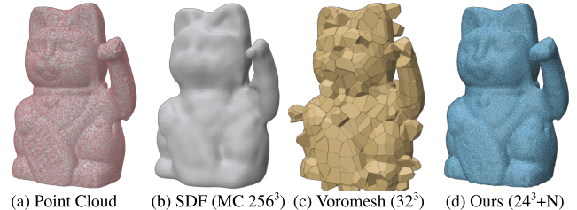

<div align="center">
<h1>DCCVT: Differentiable Clipped Centroidal Voronoi Tessellation</h1>

[**Wylliam Cantin Charawi**](https://wylliamcantincharawi.dev)<sup>1</sup> &middot;
[**Adrien Gruson**](https://profs.etsmtl.ca/agruson/)<sup>1</sup> &middot;
[**Jane Wu**](https://janehwu.github.io/)<sup>2</sup> &middot;
[**Christian Desrosiers**](https://www.etsmtl.ca/etudier-a-lets/corps-enseignant/cdesrosiers)<sup>1</sup> &middot;
[**Diego Thomas**](https://diegothomas.github.io/DigitalHumans-lab/index.html)<sup>3</sup>

<sup>1</sup>&Eacute;cole de Technologie Sup&eacute;rieure&emsp;&emsp;&emsp;<sup>2</sup>UC Berkeley&emsp;&emsp;&emsp;<sup>3</sup>Kyushu University
<br>
3DV 2026

<a href="https://openreview.net/pdf?id=FZJuem8RSi"></a>
<a href="https://arxiv.org/abs/2601.13603"></a>
<a href="https://github.com/tiwylli/DCCVT"></a>
</div>

This repo contains the DCCVT pipeline plus CUDA/native dependencies vendored as submodules. The notes below focus on the first-party code (everything outside `3rdparty/`).

GPU requirement: DCCVT uses `pygdel3d` (gDel3D) for Delaunay tetrahedralization. gDel3D requires CUDA + `nvcc`, so CPU-only runs are not supported.

<p align="center">
  
</p>

## Repository layout

- `DCCVT.py`: main CLI entrypoint.
- `dccvt/`: core library (arg parsing, training, mesh extraction).
- `argfiles/`: experiment templates (argfile format).
- `mesh/`: mesh datasets (`.ply` + `.obj`), loaded via mesh path prefix.
- `hotspots_model/`: pretrained HotSpot weights referenced by `--trained_HotSpot`.
- `outputs/`: default output root for generated meshes.
- `metrics_figs_scripts/`: metrics and rendering helpers.
- `accel/`: `voronoiaccel` extension used by metrics/utilities.
- `scripts/`: bootstrapping and patch helpers.

## Quickstart (recommended)

```bash
git clone --recurse-submodules <YOUR_REPO_URL>
cd DCCVT
bash scripts/bootstrap.sh --torch cu126
source .venv/bin/activate
python DCCVT.py --args-file argfiles/DCCVT_figs_teaser.args --mesh-ids 313444
```

CPU-only installs are not supported because `pygdel3d` requires CUDA.

Dry-run the arg expansion without running experiments:

```bash
python DCCVT.py --args-file argfiles/DCCVT_figs_teaser.args --mesh-ids 313444 --dry-run
```

## Usage

### 1) CLI (direct args)

```bash
python DCCVT.py --mesh 313444 \
  --trained_HotSpot hotspots_model/thingi32/313444.pth \
  --output outputs/dev/313444 \
  --num_iterations 50 --num_centroids 16 --sample_near 0 \
  --w_chamfer 1000 --w_cvt 100 --w_sdfsmooth 100
```

`--mesh` accepts either:
- a mesh id (resolved under the default mesh root), or
- a full mesh path prefix (with or without `.ply`/`.obj`).

### CLI parameters (full list)

All supported CLI flags come from `dccvt/argparse_utils.py`. These same keys are used by argfiles and the Python API.

- `--mesh`: mesh id or mesh path prefix (required for direct CLI).
- `--trained_HotSpot`: path to a `.pth` HotSpot weight file (required for direct CLI).
- `--output`: output directory for this run.
- `--num_iterations`: optimization steps.
- `--num_centroids`: number of grid points per axis (total sites = `num_centroids^3`).
- `--sample_near`: extra samples near manifold points (0 disables).
- `--max_amount_sites`: limit used by HotSpot dataset sampling and upsampling logic.
- `--video` / `--no-video`: enable/disable per-iteration mesh dumps.
- `--w_chamfer`: chamfer weight.
- `--w_cvt`: CVT regularization weight.
- `--w_sdfsmooth`: SDF smoothing weight.
- `--upsampling`: number of adaptive upsampling rounds.
- `--lr_sites`: optimizer learning rate.
- `--save_path`: optional override for the exact output folder.

### 2) CLI (args file)

```bash
python DCCVT.py --args-file argfiles/DCCVT_figs_teaser.args
```

Useful flags:
- `--mesh-ids 313444,441708`: override the mesh list used by `{mesh_id}` expansion.
- `--timestamp 20250101_120000`: set the output root under `outputs/`.
- `--dry-run`: print expanded argv lists and exit.

When `--args-file` is used, per-mesh CLI flags are ignored in favor of the argfile line values.

### 3) Programmatic (Python)

```python
from dccvt import run_mesh_from_params

run_mesh_from_params(
    mesh="mesh/thingi32/313444",
    trained_HotSpot="hotspots_model/thingi32/313444.pth",
    output="outputs/dev/313444",
    num_iterations=50,
    num_centroids=16,
    sample_near=0,
)
```

If you want to reuse the same parsing logic as the CLI:

```python
from dccvt.argparse_utils import parse_experiment_args
from dccvt.runner import run_mesh

args = parse_experiment_args(
    [
        "--mesh", "313444",
        "--trained_HotSpot", "hotspots_model/thingi32/313444.pth",
        "--output", "outputs/dev/313444",
        "--num_iterations", "50",
        "--num_centroids", "16",
    ]
)
run_mesh(args)
```

To execute argfiles programmatically (same behavior as CLI):

```python
from dccvt import run_from_args_file

run_from_args_file("argfiles/DCCVT_figs_teaser.args", mesh_ids=["313444"])
```

## Argfile format

Each non-comment line is a CLI template; placeholders are filled using defaults from `dccvt/argparse_utils.py`:

```text
@mesh_ids : 313444 441708
--mesh {mesh}{mesh_id} --trained_HotSpot {trained_HotSpot}thingi32/{mesh_id}.pth \
  --output {output}{mesh_id} --w_chamfer 1000 --w_cvt 100 --num_centroids 16
```

Notes:
- `{mesh_id}` expands over the active mesh list (defaults to `DEFAULTS["mesh_ids"]`).
- `@mesh_ids:` changes the active mesh list for subsequent lines.
- Known placeholders (`{mesh}`, `{trained_HotSpot}`, `{output}`, etc.) resolve via defaults.
- Unknown placeholders are left intact for manual post-processing.
- Trailing `\` continues a line.
- Values specified in the argfile override defaults.

## Outputs

By default, outputs go under `outputs/<timestamp>/`. For each experiment line, `--output` becomes the per-run folder.

Generated files include:
- `DCCVT_<upsampling>_<state>_intDCCVT_cvt*_sdfsmooth*.obj` + `.npz`
- `DCCVT_<upsampling>_<state>_projDCCVT_cvt*_sdfsmooth*.obj` + `.npz`
- `target.ply` (sampled points)

If the final `projDCCVT` mesh already exists, the runner skips that mesh.

## Metrics and renders

Batch render OBJ outputs:

```bash
python metrics_figs_scripts/DCCVT_batch_render.py outputs/<timestamp> \
  --recursive --filter final --resolution 512 512
```

Compute metrics over experiment folders:

```bash
python metrics_figs_scripts/DCCVT_figs_metrics.py \
  --root-dir /path/to/DCCVT \
  --experiments-dir outputs/<timestamp> \
  --include-final
```

Notes:
- `metrics_figs_scripts/DCCVT_metrics.py` uses hard-coded `EXPERIMENTS_DIR` and `GT_DIR`; edit the file or use `DCCVT_figs_metrics.py`.
- `metrics_figs_scripts/DCCVT_metric_check.py` launches an interactive Polyscope view for one OBJ.
- `metrics_figs_scripts/sdf_extraction.py` is a sandbox for SDF extraction; run `--help` for flags.

## Environment variables

- `DCCVT_ROOT`: override the root used for default paths (`mesh/`, `outputs/`, `hotspots_model/`).
- `DCCVT_DEVICE`: force device selection (`cpu`, `cuda:0`, etc.).

`scripts/bootstrap.sh --help` lists additional knobs (torch variant, Open3D package, build jobs).

## Manual installation (if you skip bootstrap)

### 0) Prerequisites

- Linux
- Python `3.12.x`
- Build tools for native extensions: `git`, a C/C++ compiler, `cmake`, `ninja`
- Python headers
- NVIDIA GPU with a working CUDA toolkit + driver (including `nvcc`)

### 1) Clone + submodules

```bash
git clone --recurse-submodules <YOUR_REPO_URL>
cd DCCVT
```

If you already cloned without submodules:

```bash
git submodule update --init --recursive
```

### 2) Create and activate a virtual environment

```bash
python3.12 -m venv .venv
source .venv/bin/activate
python -m pip install -U pip setuptools wheel
```

### 3) Install PyTorch first

CUDA 12.6 example:

```bash
pip install --index-url https://download.pytorch.org/whl/cu126 torch==2.7.1 torchvision==0.22.1
```

### 4) Install Python dependencies

```bash
pip install -r requirements.txt
```

### 5) Build + install local native/CUDA modules

Apply repo patches:

```bash
bash scripts/apply_patches.sh
```

Install required local extensions:

```bash
pip install -e accel
pip install -e 3rdparty/gDel3D/python_bindings
pip install -e 3rdparty/pytorch3d --no-build-isolation
```

Offline / restricted-network variant for PyTorch3D:

```bash
pip install -e 3rdparty/pytorch3d --no-build-isolation --no-deps
```

## Acknowledgements

This work was supported by JSPS/KAKENHI JP23H03439 and AMED JP24wm0625404 at Kyushu University, and by the NSERC Discovery Grant RGPIN-2022-03182. J. W. was supported by NSF and UC President's Postdoctoral Fellowships.

## Citation

If you find this project useful, please consider citing:

```bibtex
@inproceedings{charawi20263dv,
  author    = {Charawi, Wylliam Cantin and Gruson, Adrien and Wu, Jane and Desrosiers, Christian and Thomas, Diego},
  title     = {DCCVT: Differentiable Clipped Centroidal Voronoi
               Tessellation},
  booktitle = {Proceedings of the 15th International Conference on 3D Vision (3DV)},
  year      = {2026},
  month     = {March},
  address   = {Vancouver, BC, Canada}
}
```